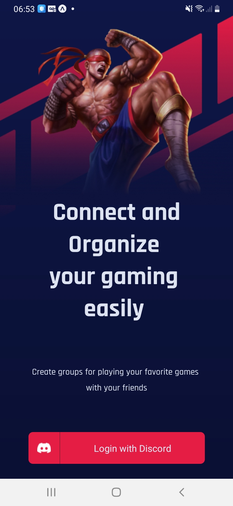
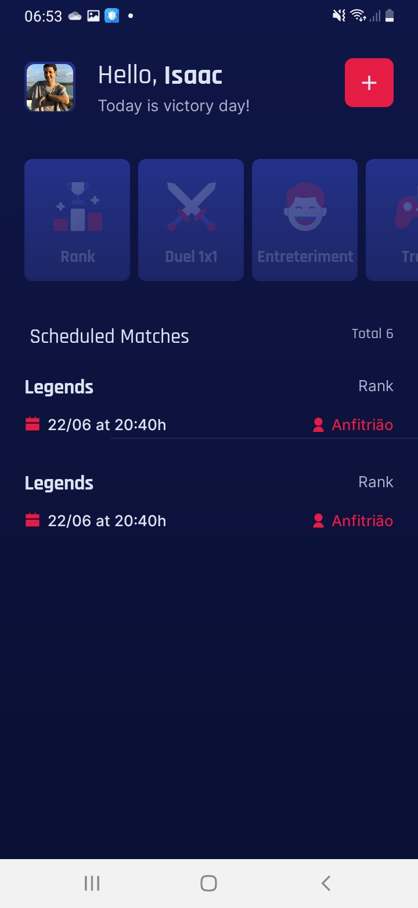
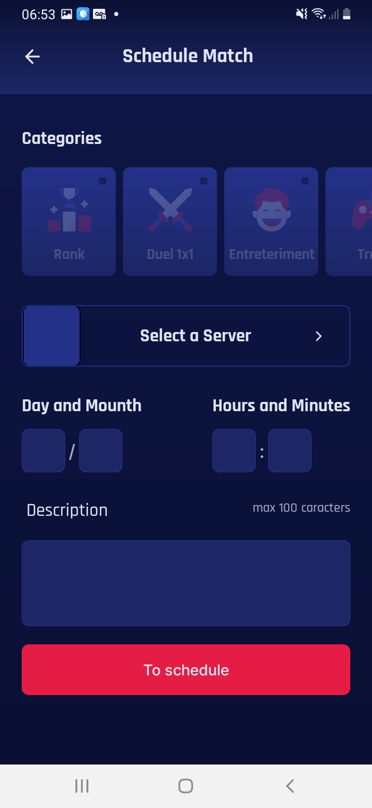
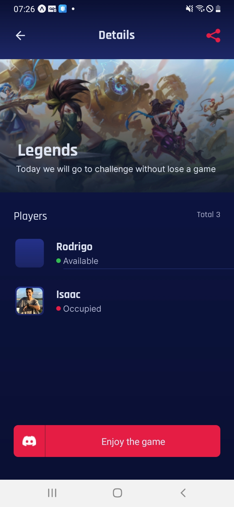

<h1 align="center">
  📱 Gameplay App 🎲 
</h1>
<h1 align="center">
 
</h1>

<p align="center">
 
 
 
 
</p>


## 💻 Project
📖 Gameplay organizer for players, this RocketSeat project in Next Level Week Together  xxx, 🍏

## 🔨 Features

- [X] Allows you to schedule matches.
- [X] Allows filter by categories.
- [X] Displays whether the match was scheduled on its own server (host) or on other servers (guest);
- [X] And More...


## ✨ Technologies

- [X] React Native
- [X] Typescript
- [X] Expo
- [X] Context API
- [X] Async Storage
- [X] Vector Icons
- [X] React Native Svg e Svg Transform
- [X] Expo Google Fonts
- [X] And More...


## 🔖 Layout

<p align="center">
 
 
 
 
</p>


# x DOCS

This is a [Expo](https://expo.dev/) project  with [`React-Native`](https://reactnative.dev/).

## Getting Started

First you must have Expo installed in your smartphone, run the development server in cmd:

```bash
expo start
```

## Enjoy

 Started this project training! 💖